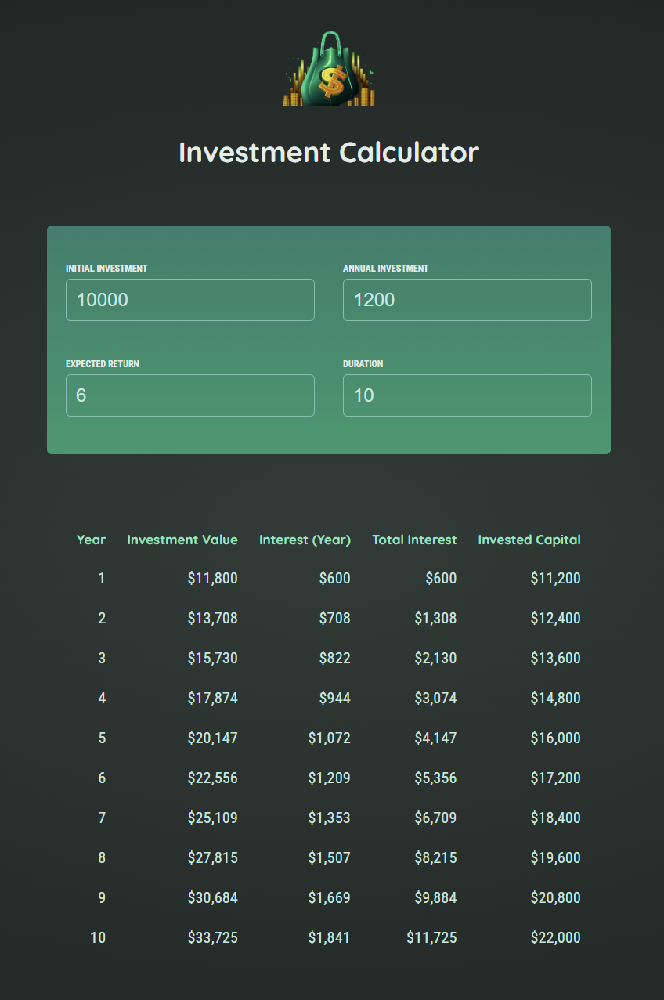

# 💰 Investment Calculator

A professional-grade React application designed to calculate and visualize investment growth over time. Powered by modern web technologies for optimal performance and user experience.

## 📋 Overview

The Investment Calculator enables users to model their investment portfolio by inputting key financial parameters. The application automatically calculates year-by-year growth projections, total returns, and accumulated interests to help users make informed investment decisions.

---

## 🚀 [Live Demo](https://react-investment-calculator-mu.vercel.app/)

## 📸 Screenshots

### Homepage


_Main interface of the Investment Calculator showing the input form and year-by-year results table._

---

## 🚀 Features

- 💸 **Flexible Investment Parameters**: Configure initial investment, annual contributions, expected return rate, and investment duration
- ⚡ **Real-Time Calculations**: Instant recalculation of results as input values change
- 📊 **Detailed Year-by-Year Breakdown**: View comprehensive analysis including annual returns, cumulative interest, and invested capital
- 📱 **Responsive Design**: Seamless experience across desktop and mobile devices
- 🎨 **Modern UI/UX**: Clean, intuitive interface with professional styling
- ✅ **Input Validation**: Automatic validation to ensure meaningful calculations

## 🛠 Tech Stack

| Layer                  | Technology                 |
| ---------------------- | -------------------------- |
| ⚛️ **Framework**       | React 19                   |
| ⚡ **Build Tool**      | Vite 4                     |
| 🎨 **Styling**         | CSS3 (Modern & Responsive) |
| 🖥️ **Runtime**         | Node.js                    |
| 📦 **Package Manager** | npm                        |

## ⚙️ Installation

### Prerequisites

- 🖥️ Node.js (v16 or higher)
- 📦 npm or yarn

### Setup Steps

```bash
# Clone the repository
git clone https://github.com/yourusername/react-investment-calculator.git
cd react-investment-calculator

# Install dependencies
npm install

# Start development server
npm run dev
```

The application will be available at `http://localhost:5173`

## 📝 Usage

1. **💰Enter Initial Investment**: Input the starting capital amount
2. **💵Set Annual Contribution**: Specify how much you plan to invest annually
3. **📈Define Expected Return**: Enter the anticipated annual return rate (%)
4. **⏳Set Duration**: Choose the investment period in years
5. **📊View Results**: The calculator displays year-by-year growth projections in a detailed table

## Project Structure

```
react-investment-calculator/
├── src/
│   ├── components/
│   │   ├── Header.jsx          # Application header
│   │   ├── UserInput.jsx       # Investment parameters input form
│   │   └── Results.jsx         # Year-by-year results display
│   ├── util/
│   │   └── investment.js       # Investment calculation logic
│   ├── App.jsx                 # Main application component
│   ├── index.jsx               # Application entry point
│   └── index.css               # Global styles
├── public/                     # Static assets
├── vite.config.js             # Vite configuration
├── package.json               # Project dependencies
└── README.md                  # Documentation
```

## Available Scripts

```bash
# Start development server with hot module replacement
npm run dev

# Build for production
npm run build

# Preview production build
npm run preview

# Run ESLint for code quality checks
npm run lint
```

## 🧩 Key Components

### 🏷️ Header

Displays the application title and branding.

### 🖊️ UserInput

Interactive form component for collecting investment parameters:

- 💰 Initial Investment Amount
- 💵 Annual Contribution
- 📈 Expected Annual Return Rate (%)
- ⏳ Investment Duration (Years)

### 📊 Results

Displays comprehensive investment growth projections in a formatted table showing:

- 🗓️ Year number
- 💸 Interest earned
- 📈 Total interest accumulated
- 💰 Invested capital

## 🔢 Calculation Logic

The application uses standard compound interest formulas to calculate investment growth:

$$\text{Future Value} = P(1 + r)^n + PMT \times \frac{((1 + r)^n - 1)}{r}$$

Where:

- **P** = Initial investment
- **PMT** = Annual contribution
- **r** = Expected return rate (annual)
- **n** = Number of years

## ⚡ Performance

- 🚀 Optimized build with Vite for fast page loads
- ⚛️ React component optimization for smooth interactions
- ⏱️ Instant calculation results without server latency

## 🌐 Browser Support

- Chrome/Edge (latest versions)
- Firefox (latest versions)
- Safari (latest versions)
- Modern mobile browsers

## 🤝 Contributing

Contributions are welcome! Please feel free to submit a pull request with improvements or bug fixes.

## 🔮 Future Enhancements

- 💾 Export results to CSV/PDF
- 📊 Multiple investment scenarios comparison
- 📉 Inflation adjustment calculations
- 💰 Tax considerations
- 📈 Historical market data integration
- 🌗 Dark/Light theme toggle

## 📝 License

Vasyl Pryimak  
_This project was created as part of a React advanced course / personal learning exercise._

## 👨‍💻 Author

**Vasyl Pryimak**  
GitHub: [https://github.com/vasylpryimakdev](https://github.com/vasylpryimakdev)  
LinkedIn: [https://www.linkedin.com/in/vasyl-pryimak-64a204384](https://www.linkedin.com/in/vasyl-pryimak-64a204384)
